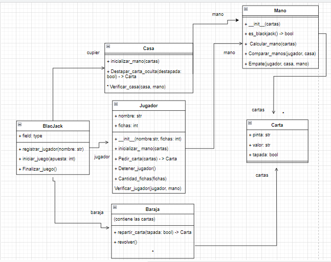
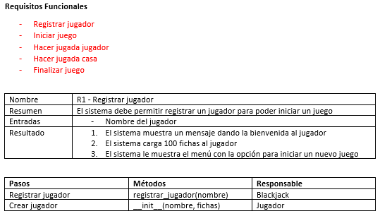
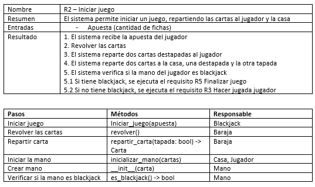
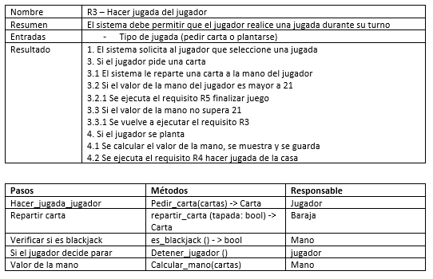
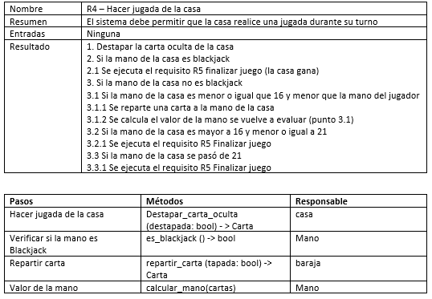
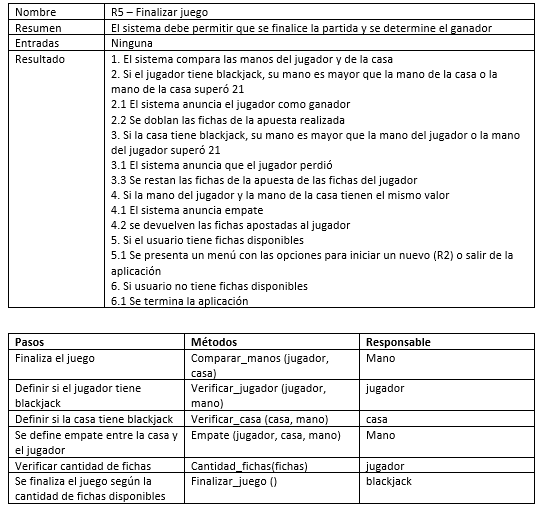

#  Black Jack
### Modelo del mundo

### Requisitos funcionales y su asignación de responsabilidades
#### 1. requisito funcional R1

#### 2. requisito funcional R2

#### 3. requisito funcional R3

#### 4. requisito funcional R4

#### 5. requisito funcional R5
